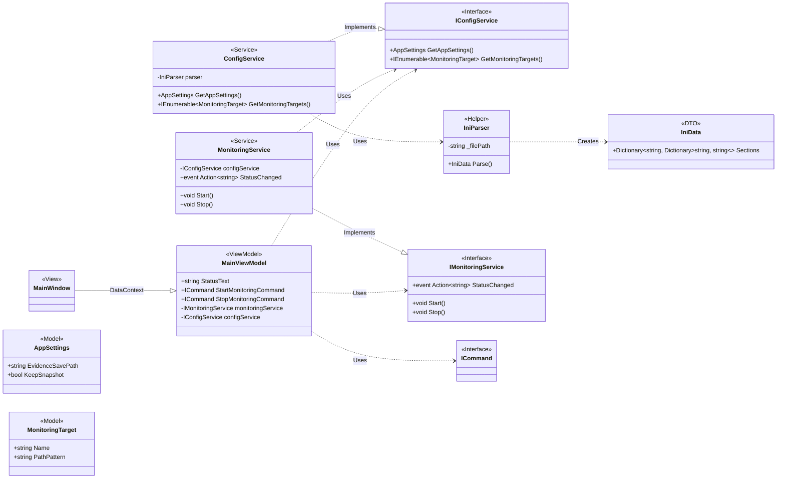

# クラス図

このドキュメントは、エビデンスサポートツールのクラス構造を定義します。

## クラス詳細

### Views

- **MainWindow**:
  - アプリケーションのメインウィンドウ（UI）です。
  - `DataContext`として`MainViewModel`を持ち、UI 要素を ViewModel のプロパティやコマンドにバインドします。

### ViewModels

- **MainViewModel**:
  - UI の状態とロジックを管理します。
  - `StatusText`: UI に表示される現在のステータス（"待機中", "監視中"など）です。
  - `StartMonitoringCommand`: 監視開始ボタンにバインドされるコマンドです。実行されると`IMonitoringService`の`Start`メソッドを呼び出します。
  - `StopMonitoringCommand`: 監視停止ボタンにバインドされるコマンドです。実行されると`IMonitoringService`の`Stop`メソッドを呼び出します。

### Models

- **AppSettings**:
  - `setting.ini`の`[Settings]`セクションに対応するデータモデルです。
  - `EvidenceSavePath`: エビデンスの保存先パスを保持します。
  - `KeepSnapshot`: スナップショットを保持するかどうかの設定を保持します。
- **MonitoringTarget**:
  - `setting.ini`の`[Targets]`セクションの個々のエントリに対応するデータモデルです。
  - `Name`: ターゲット名（出力フォルダ名）を保持します。
  - `PathPattern`: 監視対象のパス（ワイルドカードや日付フォーマットを含む）を保持します。
- **IniData**:
  - `IniParser`によってパースされた INI ファイルの生データを保持するデータ転送オブジェクト(DTO)です。
  - `Sections`: セクション名をキーとし、そのセクション内のキーと値の辞書を値として持つ、ネストされた辞書構造です。

### Services

- **IConfigService** (Interface):
  - 設定情報を取得するための契約を定義します。
  - `GetAppSettings()`: `AppSettings`オブジェクトを取得します。
  - `GetMonitoringTargets()`: `MonitoringTarget`のコレクションを取得します。
- **ConfigService**:
  - `IConfigService`の実装クラスです。
  - `IniParser`を利用して INI ファイルの内容を解析し、その結果を`AppSettings`や`MonitoringTarget`といった、アプリケーションで扱いやすいモデルオブジェクトに変換する責務を持ちます。
- **IMonitoringService** (Interface):
  - ログ監視のコア機能に関する契約を定義します。
  - `Start()`: 監視プロセスを開始します。
  - `Stop()`: 監視プロセスを停止し、差分を検出・保存します。
  - `StatusChanged`: ステータスの変更を ViewModel に通知するためのイベントです。
- **MonitoringService**:
  - `IMonitoringService`の実装クラスです。
  - 監視の開始時には、対象ファイルの現在の状態のスナップショットを作成します。
  - 監視の停止時には、再度スナップショットを作成し、開始時のものと比較して差分を特定し、結果を`EvidenceSavePath`に保存します。

### Helpers

- **IniParser**:
  - INI ファイルを解析する責務を持つヘルパークラスです。
  - 特定のモデル（`AppSettings`など）には依存せず、汎用的な`IniData`オブジェクトを生成します。
