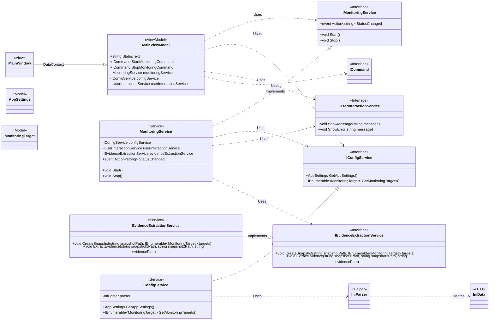

# クラス図

このドキュメントは、エビデンスサポートツールのクラス構造を定義します。

## クラス詳細

### Views

- **MainWindow**:
  - アプリケーションのメインウィンドウ（UI）です。
  - `DataContext`として`MainViewModel`を持ち、UI 要素を ViewModel のプロパティやコマンドにバインドします。

### ViewModels

- **MainViewModel**:
  - UI の状態とロジックを管理します。
  - `IUserInteractionService` を通じて、ユーザーへの通知（メッセージやエラーダイアログの表示）を要求します。
  - `StatusText`: UI に表示される現在のステータス（"待機中", "監視中"など）です。
  - `StartMonitoringCommand`: 監視開始ボタンにバインドされるコマンドです。実行されると`IMonitoringService`の`Start`メソッドを呼び出します。
  - `StopMonitoringCommand`: 監視停止ボタンにバインドされるコマンドです。実行されると`IMonitoringService`の`Stop`メソッドを呼び出します。

### Models

- **AppSettings**:
  - `setting.ini`の`[Settings]`セクションに対応するデータモデルです。
  - `EvidenceSavePath`: エビデンスの保存先パスを保持します。
  - `KeepSnapshot`: スナップショットを保持するかどうかの設定を保持します。
- **MonitoringTarget**:
  - `setting.ini`の`[Targets]`セクションの個々のエントリに対応するデータモデルです。
  - `Name`: ターゲット名（出力フォルダ名）を保持します。
  - `PathPattern`: 監視対象のパス（ワイルドカードや日付フォーマットを含む）を保持します。
- **IniData**:
  - `IniParser`によってパースされた INI ファイルの生データを保持するデータ転送オブジェクト(DTO)です。
  - `Sections`: セクション名をキーとし、そのセクション内のキーと値の辞書を値として持つ、ネストされた辞書構造です。

### Services

- **IUserInteractionService** (Interface):
  - ユーザーへの通知（ダイアログ表示など）を行うための契約を定義します。これにより、ビジネスロジック層が UI 層に直接依存することを防ぎます。
  - `ShowMessage(string message)`: 情報メッセージを表示します。
  - `ShowError(string message)`: エラーメッセージを表示します。
- **IConfigService** (Interface):
  - 設定情報を取得するための契約を定義します。
  - `GetAppSettings()`: `AppSettings`オブジェクトを取得します。
  - `GetMonitoringTargets()`: `MonitoringTarget`のコレクションを取得します。
- **ConfigService**:
  - `IConfigService`の実装クラスです。
  - `IniParser`を利用して INI ファイルの内容を解析し、その結果を`AppSettings`や`MonitoringTarget`といった、アプリケーションで扱いやすいモデルオブジェクトに変換する責務を持ちます。
- **IMonitoringService** (Interface):
  - ログ監視のライフサイクル管理に関する契約を定義します。
  - `Start()`: 監視プロセスを開始します。
  - `Stop()`: 監視プロセスを停止し、差分を検出・保存します。
  - `StatusChanged`: ステータスの変更を ViewModel に通知するためのイベントです。
- **MonitoringService**:
  - `IMonitoringService`の実装クラスです。監視フローの制御に責任を持ちます。
  - `IEvidenceExtractionService` を利用して、スナップショットの作成や差分抽出などの具体的なファイル操作を委譲します。
  - 差分がなかった場合や、処理中にエラーが発生した場合は、`IUserInteractionService` を介してユーザーへの通知を要求します。
- **IEvidenceExtractionService** (Interface):
  - エビデンスの抽出に関する具体的なファイル操作の契約を定義します。
  - `CreateSnapshot(string snapshotPath, IEnumerable<MonitoringTarget> targets)`: 指定されたパスに、監視対象のスナップショットを作成します。
  - `ExtractEvidence(string snapshot1Path, string snapshot2Path, string evidencePath)`: 2 つのスナップショットを比較し、差分を指定されたパスに保存します。
- **EvidenceExtractionService**:
  - `IEvidenceExtractionService`の実装クラスです。
  - スナップショットの作成、ファイル比較、差分ファイルの保存など、実際のファイルシステム操作に責任を持ちます。

### Helpers

- **IniParser**:
  - INI ファイルを解析する責務を持つヘルパークラスです。
  - 特定のモデル（`AppSettings`など）には依存せず、汎用的な`IniData`オブジェクトを生成します。
